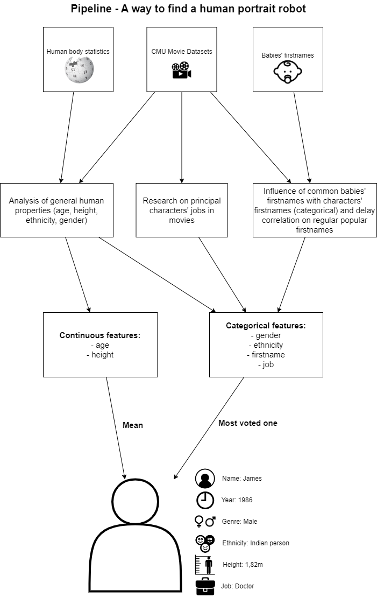

## Legacy of Earth civilization based on a movie dataset.

How would aliens figure Earth if they had only the CMU dataset?

## Data Story :book:

🌍 You can find our alien Data story [here](https://jeanlefort.github.io/).

## ABSTRACT

In the dire year of 2023, as the impending collapse of our Earth civilization loomed large on the horizon, a group of desperate scientists raced against time to launch a last-ditch effort to preserve the essence of humanity. The chosen vessel for our legacy was a satellite destined to journey far beyond the confines of our troubled planet. In the eleventh hour, the scientist entrusted with the monumental task of uploading the data onto the satellite found themselves armed with an unexpected but strangely fitting resource—the CMU Movie Summary Corpus, a rich collection of narratives encapsulating the essence of our collective imagination. The satellite, now carrying the weight of our cultural legacy, soared into the vast unknown of space. Meanwhile, on Earth, the remnants of our civilization could only hope that these celluloid chronicles would serve as a cryptic Rosetta Stone for any extraterrestrial intelligences that might one day stumble upon this cosmic time capsule.

Ten thousand years later and far away from our decaying home, alien discoverers puzzled over the enigmatic treasure trove they had stumbled upon. Their advanced intellects delved into the intricacies of our stories, attempting to decipher the nuances of a civilization long gone. Through the lens of our cinematic legacy, these alien archaeologists sought to unravel the mysteries of what is human. An alien student class decided to present their findings to their teacher about what they have learned from the CMU Movie Summary Corpus.

## RESEARCH QUESTIONS

•	What should the typical human look like, if the only information we had about them was this dataset?
•	What does the information on names obtained by the aliens say about our society? Is there a correlation between babies’ names and actors’ names in films? If yes, is it possible to determine whether one of them causes the other?
•	Can we infer the main relations between countries by analysing synopses, and draw a graph of countries with respect to how strongly they interact with each other?
•	Can we elaborate a metric system that would rate the likelihood/representativity of pools of movies on different criteria about the Earth population? 
•	Can we spot biases linked to the fact that most movies are either produced or occur in the USA?

## COMPLEMENTARY DATASETS

In order to better understand the nature of the data that the extraterrestrials have recovered, we are comparing our data set with other dataset describing the reality of our society unbiased. 
We use additional datasets, namely one about the babies' firstnames in the USA classified by year; about 7MB. We also use additional data about the US population, as regards distributions of ages, ethnicities, heights, genders. Such data is quite light and does not require huge dataset. 
As our goal is to extract the most of the main dataset so that with a dataset extended by few data, Aliens could be able to draw valubale insights about human society and for exemple, build a robot-portrait
We also use additional data about the US population, as regards distributions of ages, ethnicities, heights, genders. Such data is quite light and does not require huge dataset. 

## METHODS

### Main External libraries
* plotly
* Networkx
* scipy.stats
* seaborn
* wordcloud
* statsmodel
* sklearn

* For task 1 (**robot portrait**):
We mostly analyze the means of features (if continuous, like height) or the most represented ones (if categorical, like occupations). This also serves as an exploration of the dataset, and to find what kind of movies humans like. We performed some t-tests to reject hypotheses, pair matching to reduce the influence of cofactors, and linear regression to demonstrate correlations (not causations).

* For task 2 (**metric system that rates pools of movies**): we define a metric for each of our criteria (height, age, gender, ethnicity), which we compare to the reference data for the USA. We can then compare pools of movies over these criteria. We optimize the number of movies per pool (*N_opt*), and then find the optimal pool of *N_opt* movies.
We then use machine learning tools to analyse the impact of movies'genres on the scores, and last we end-up with an evaluation of our metric's robustness.

* For task 3 (**influence of actors’ names on babies’ names**): we first investigate simple correlations. Have some names appeared after these movies? We can think of Leia which did not exist before the Star Wars first trilogy, but was given to a few thousands babies afterwards. Are there only a few highly noticeable examples, or can we also observe little increases for already popular names? To evaluate the real impact and confirm or infirm our assumptions, we should use statistical tools such as cross-correlations.

* For task 4 (**building a graph of relationship of countries**): We analyse the synopses (which are strings) to look for synopses that mention several countries and value the interactions between them (any type they be). Assuming high interaction go on with geographical proximity (historically, countries were closely related with their neighbours), we can then produce a theoretical map of countries on Earth, that are seen as islands in an ocean.

## TIMELINE AND ORGANIZATION WITHIN THE TEAM

We separated the whole team into subgroups to focus on our different tasks. 
Within each subgroup, we have defined precise timelines to reach our respective objectives in time for Milestones 2 and 3. However, we keep discussing all together on the big picture to maintain a global consistency within our work. 

**Task 1:** 
- Milestone 2: Define the characteristics of interest for the robot portrait. Extract information about these features at a certain time and place.
- Milestone 3: Conduct t-tests on actresses' representation as doctors, explore people's movie preferences, and devise strategies to mitigate the influence of time (resulting from inflation and the development of the movie industry) to obtain accurate results regarding box-office revenues. Extract information from character names, including military ranks and doctor positions.

**Task 2:**
- Milestone 2: Selection of 4 test criteria: age, gender, height, ethnicity & Definition of the metric for each criterion & Evaluation of a few movies with this process
- Milestone 3: Evaluation of pools of movies 
               Understanding of reasons why types/genres of movies rank higher or lower
               Finding the ideal subset of the CMU dataset
               Assessment of the impact of scores on the prediction of scores thanks to linear regression and random forests
               Evaluation of the robustness of the metric

**Task 3:**
- Milestone 2: For 400 names given in the USA, study of the frequency of the names given in the babies population and the actors population. Plot of visible correlations: which come first?
- Milestone 3: Refinement of this study by region and years groups. Also focus on common names, for which the analysis might be tenuous, whereas original names like Leia are much less easy to study. Also, use of precise assumptions and statistical tools answer the question of causal links: did some movies likely result in increasing number of babies named 'XX'?

**Task 4:**
- Milestone 2: No analysis performed yet.
- Milestone 3: Extraction of the strings contained in the synopses to establish frequency relationships between two or more countries.

## Team Organization:
* Paul : Influence of names, country map, website creation
* Hugo : robot portrait, dataset exploration
* Jean : robot portrait, website creation, datastory
* Pierre-Marie : Definition of the metric, optimization of scores functions, robustness/sensitivity analysis
* Guillaume : Optimization of N_opt, correlation between subscores, impact of genres on scores